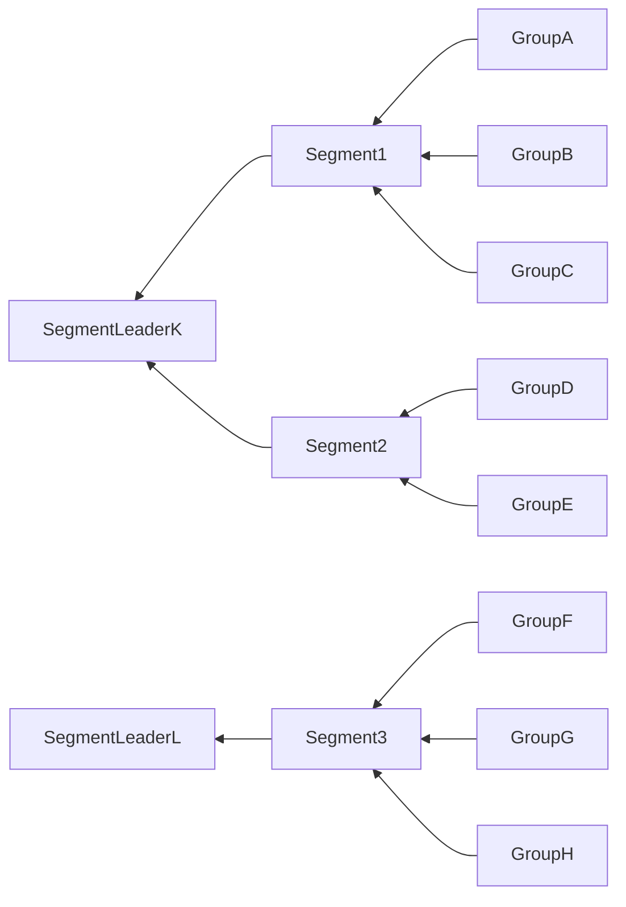

# curve

```mermaid
graph RL
  GroupA --> Segment1
  GroupB --> Segment1
  GroupC --> Segment1
  GroupD --> Segment2
  GroupE --> Segment2
  GroupF --> Segment3
  GroupG --> Segment3
  GroupH --> Segment3

  Segment1 --> SegmentLeaderK
  Segment2 --> SegmentLeaderK
  Segment3 --> SegmentLeaderL

  
```
